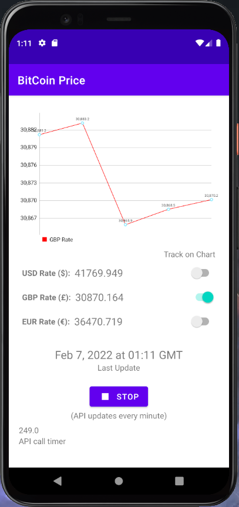

# MicroMkt OOP Interview Coding Test

Submission by: Aryan Akbarpour (aryan.akr@yahoo.com)

## Screenshot

## Implementation
- Dependency Injection with Hilt
- API managment with Retrofit
- Periodic task with Broadcast receivers

## How to Run
Open the this folder in Android Studio I guess. There is also 2 tests:
- Retrofit unit test
- Timer button integeration test